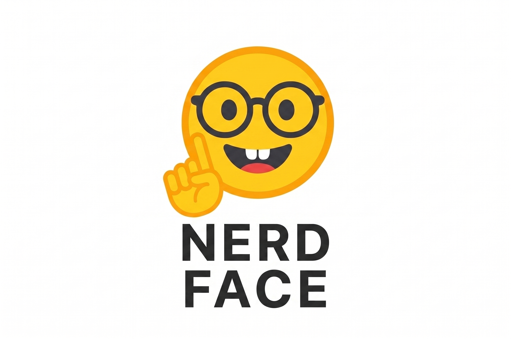

<p align="center">
  
</p>

# ☝️🤓 Nerdface

local agent. Hackable.

## Features

- **Sandbox**: Strong isolation via Shuru MicroVM.
- **Memory**: Local Holographic HRR + FTS5. O(log N) scaling.
- **Browser**: Camofox. Self-hosted, anti-bot.
- **Search**: 
  - **DuckDuckGo**: Built-in anonymous web search.
- **State**: SQLite persistence at `~/.nerdface/state.db`.

## Setup
```bash
uv sync
```

## Execution
### CLI
```bash
uv run cli.py
```

---

## Legacy Documentation (Archive)

<details>
<summary>View original README content</summary>

# ☝️🤓 NERD FACE 

A hackable, lightweight local agent hardened for production

## Project Focus for MVP (Work In Progress)

#### Security

- [] **Guardrails** - Input scanning to prevent prompt injection ( tried llm-guard backed by NLP models, but goes overboard on user inputs ) 
- [ ] **Policy** - Human-in-the-loop approvals (out of band or Auth'd IDV. Would like out of band links and biometric scans ) for destructive actions, all policy outside the prompt.
- [x] **Observability** - Arize Phoenix

#### Agent AI Stuff

- [X] **Memory** - Local HRR Holographic X FTS5 O(log N) with trust score RRF. 
- [ ] **Sub-agents** - a deep research workflow, reflection, reflexion, critics
- [X] **Search Engine:** DuckDuckGo
- [X] **Plugins Allowed** 
- [X] **CLI** - now with /paste mode for multi-line inputs
- [X] **Web Browser** - Camofox, simple web_fetch converts HTML to markdown and github code to raw text.

- [X] **System Design Patterns for Small language models** 
- [X] **Compression** - head / tail with summarize the middle.
- [ ] **NerdPrompt** - allow to be used with NerdPrompt in terminal. THINK: ASCII BBS output.

## Feature Updates

#### State Persistence

The agent saves conversation history to SQLite at `~/.nerdface/state.db` using the `user` field from `/v1/chat/completions` as the session ID.

</details>
